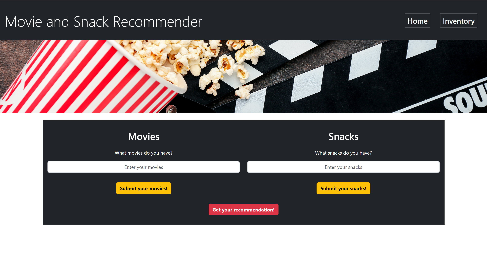
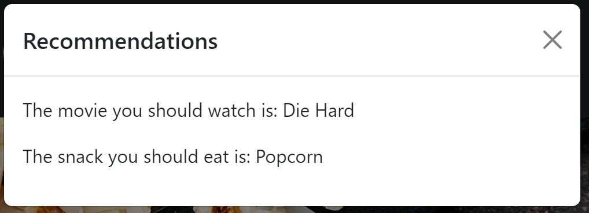
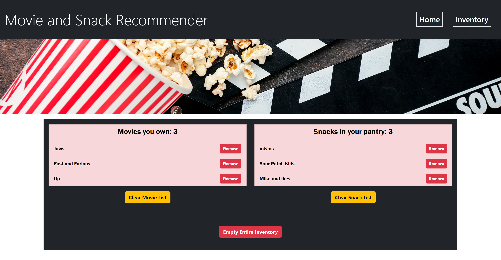
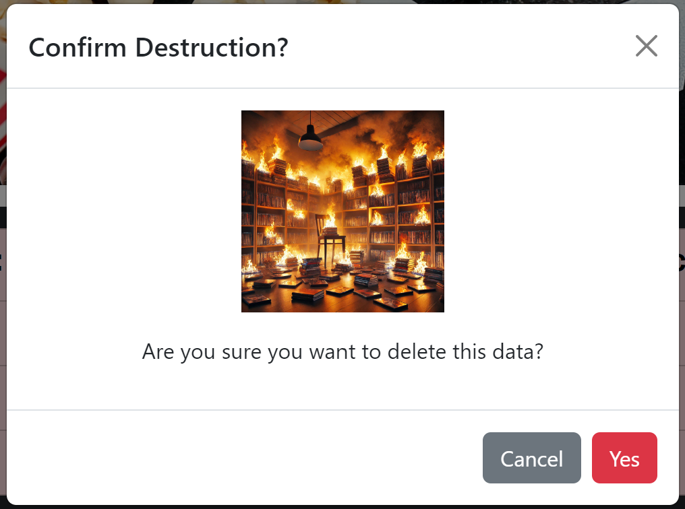

# <Snack-and-Movie-Recommender>

https://joshuag0603.github.io/movieNsnackinator/index.html

## Description

This website was created for people who are overwhelmed with choices for deciding what movie to watch. The website provides a movie and snack recommendation from the movies and snacks the user adds to their library. We built this project because it allowed us to demonstrate specific applications of coding skills we have gained. During this project we learned the basics of using the Bootstrap CSS framework, how to create and deploy branches for shared repo in Github, and some of the intricacies of functions in Javascript and their logic. The project was built using HTML, CSS, and JavaScript. 

## Installation

N/A

## Usage

The website's Home Page has two input forms to add Movies and Snacks into the browser's local storage. One movie/snack must be entered at a time and the form will display an error message if no movie or snack is added into the input field. The user must click the button below the input field for the movie/snack to be added to local storage. The third button at the bottom of the page outputs a random snack and movie from local storage and displays them in a modal on the screen. 

    
The Inventory Page shows two lists, one for the movies you added and one for the snacks you added. These are pulled from the browser's local storage. You can remove movies and snacks individually, clear out an entire single list, or clear out both lists at once. There are modals that pop up to confirm you want to clear out the entire list. 

## Credits

Collaborators
    - Joshua Gilbert (https://github.com/joshuag0603)
    - Lina Silverheart (https://github.com/Silv3rHRT)
    - Mariel Metalios (https://github.com/marielmetalios)
    - William Sanchez (https://github.com/Wsanchez91)

CSS Framework: Bootstrap 5.3.3 (<https://getbootstrap.com/>)

- movieFire.jpg Image generated using OpenAI's DALL·E 2 (2024)
- emptyPantry.jpg Image generated using OpenAI's DALL·E 2 (2024)
- tornadoCollection.jpg Image generated using OpenAI's DALL·E 2 (2024)
- filmBanner.png Image made in Canva
- movieBanner.png Image made in Canva
- popcornMovieBanner Image made in Canva

## License

MIT License

Copyright (c) [2024] [Joshua Gilbert, Lina Silverheart, Mariel Metalios, William Sanchez]

Permission is hereby granted, free of charge, to any person obtaining a copy
of this software and associated documentation files (the "Software"), to deal
in the Software without restriction, including without limitation the rights
to use, copy, modify, merge, publish, distribute, sublicense, and/or sell
copies of the Software, and to permit persons to whom the Software is
furnished to do so, subject to the following conditions:

The above copyright notice and this permission notice shall be included in all
copies or substantial portions of the Software.

THE SOFTWARE IS PROVIDED "AS IS", WITHOUT WARRANTY OF ANY KIND, EXPRESS OR
IMPLIED, INCLUDING BUT NOT LIMITED TO THE WARRANTIES OF MERCHANTABILITY,
FITNESS FOR A PARTICULAR PURPOSE AND NONINFRINGEMENT. IN NO EVENT SHALL THE
AUTHORS OR COPYRIGHT HOLDERS BE LIABLE FOR ANY CLAIM, DAMAGES OR OTHER
LIABILITY, WHETHER IN AN ACTION OF CONTRACT, TORT OR OTHERWISE, ARISING FROM,
OUT OF OR IN CONNECTION WITH THE SOFTWARE OR THE USE OR OTHER DEALINGS IN THE
SOFTWARE.following sections.